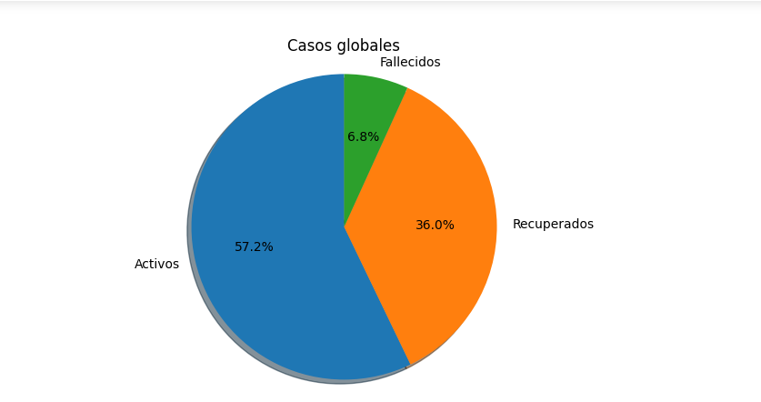
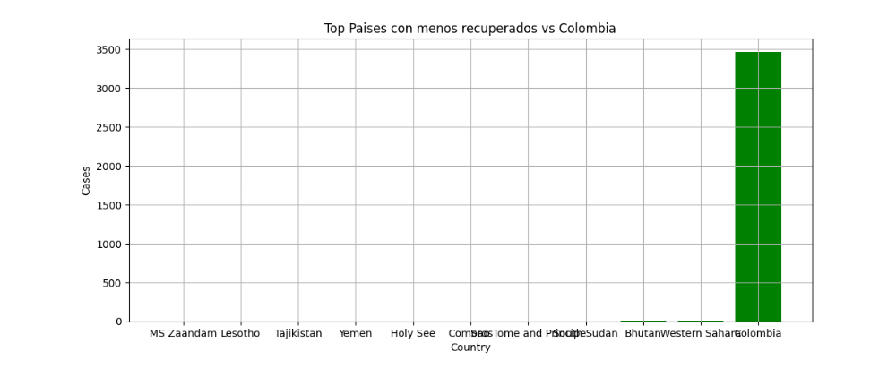

# Análisis de Colombia vs el Mundo

# ST0263 Tópicos especiales en telemática

## Fuentes

   * A nivel de Colombia:
     https://www.datos.gov.co/Salud-y-Protecci-n-Social/Casos-positivos-de-COVID-19-en-Colombia/gt2j-8ykr/data
     https://data.humdata.org/dataset/positive-cases-of-covid-19-in-colombia

   * A nivel global
     https://data.humdata.org/dataset/novel-coronavirus-2019-ncov-cases
     
     
## Visualizacion y comparación 
  
  * Cargamos todos los datasets almacenados en S3
 

  * Comparativa de Colombia vs El Top de los 5 Paises mas infectados del mundo
   
  -----------------------------------------
  
  * Comparacion de distribucion de los casos en Colombia vs el mundo: Recuperados, Fallecidos y aún activos
    1. Colombia
    
    ---------------------------------------
    
    
  
    2. El mundo
    -------------------------------
    

  
  * Comparativa de Colombia vs El Top de los 5 Paises mas recuperados del mundo
  
  -------------------------------------------
  
  * Comparativa de Colombia vs El Top de los 5 Paises con mas muertes del mundo
  
  -------------------------------------------
  
  * Comparativa de Colombia vs El Top de los 10 Paises menos infectados del mundo
  
  -------------------------------------------
  
  * Comparativa de Colombia vs El Top de los 10 Paises con menos muertes del mundo
  
  -------------------------------------------
  
  * Comparativa de Colombia vs El Top de los 10 Paises con menos recuperados del mundo
  
  -------------------------------------------
  
  * Comparativas de Colombia vs el mundo en los casos reportados en los primeros 5 meses
    1. El mundo: 
      -------------------------------------------
    

    2. Colombia:
     -------------------------------------------
    
 
  
  
## NOTEBOOKS, EMR, SPARK

Para mas detalle acerca de las consultas, funciones y código de como se obtuvieron las graficas y visualizaciones ingresar al notebook:
[covid19mundovscolombia.ipynb](covid19mundovscolombia.ipynb)
