# Analisis nivel Colombia
# ST0263 Tópicos especiales en telemática

## Fuentes de datos:

* https://www.datos.gov.co/Salud-y-Protecci-n-Social/Casos-positivos-de-COVID-19-en-Colombia/gt2j-8ykr/data
* https://data.humdata.org/dataset/positive-cases-of-covid-19-in-colombia

## Ingesta y almacenamieno: Datalake S3
  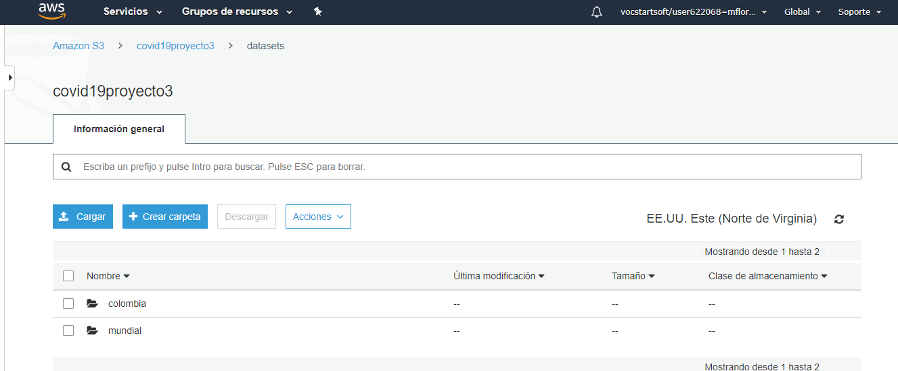
  
## Procesamiento : Analisis exploratorio y descriptivo
  
  Consultas:
  
  * Cantidad de pacientes por cada estado
  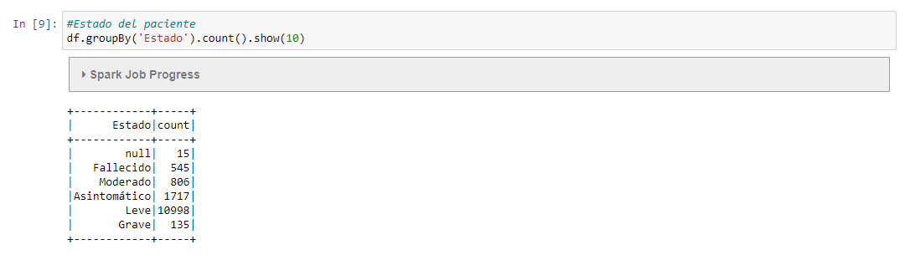
  
  * Alguna información de los fallecidos
  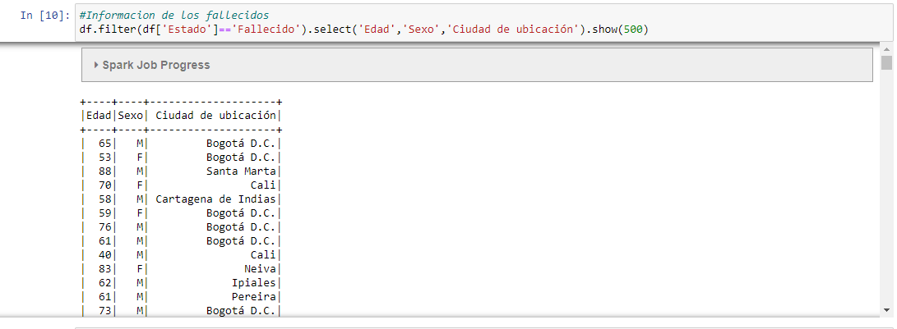
  
  * Cantidad de fallecidos por ciudad
  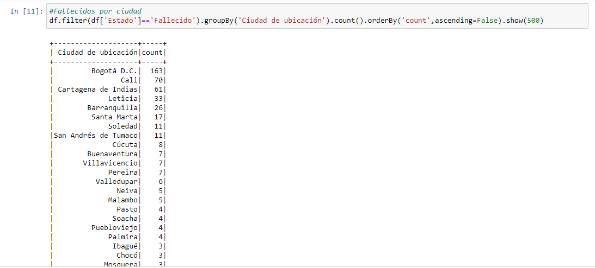
  
  * Cantidad de recuperados por ciudad
  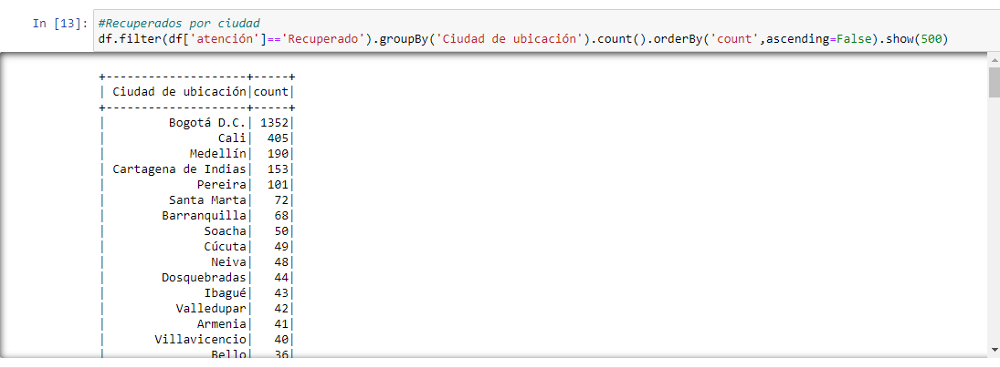
  
  * Fechas de diferencia entre los sintomas, el diagnostico y la recuperacion de los pacientes
  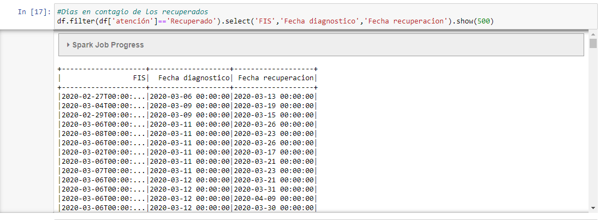
  
  * Personas agrupadas por el estado en el que se encuentran y la edad
  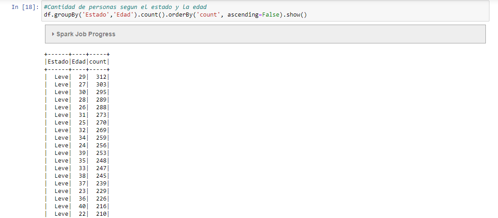
  
  * Alguna información de los asíntomaticos
  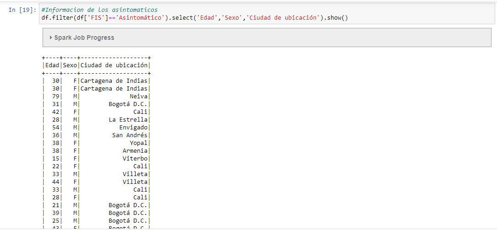
  
  * Información de las personas que se encuentran bajo cuidados intensivos
  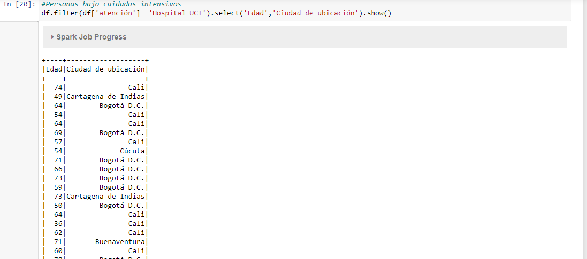
  
  * Promedio de edad de los fallecidos por genero
  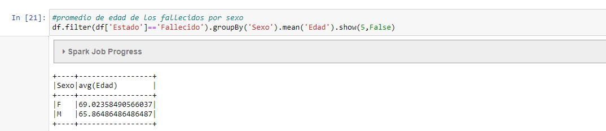
  
  * Cantidad de recuperados por género
  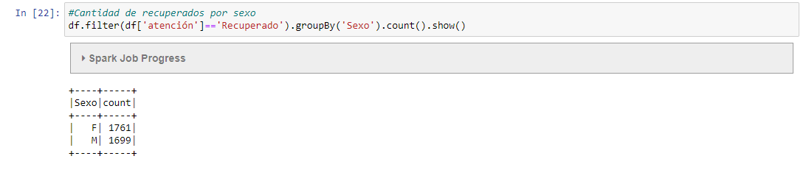
  
  * ¿De donde provienen olos contagios?
  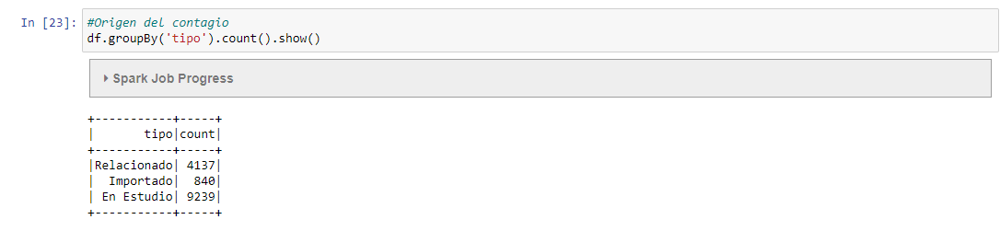
  
  * ¿Si los casos son importados, de que ciudad vienen mayormente?
  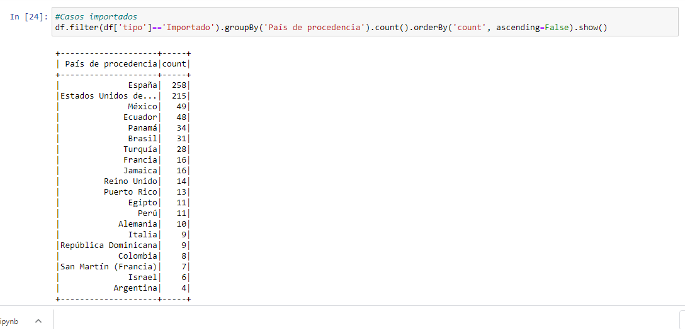
  
## Visualizacíon 
  
  * Casos por departamento: Totales(Naranja), Recuperacion(Verde) y Muertes(Rojos)
  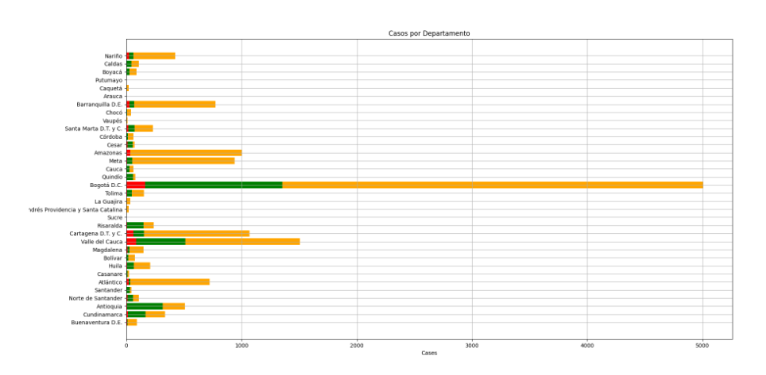
  
  * Distribucion de los fallecidos por género
  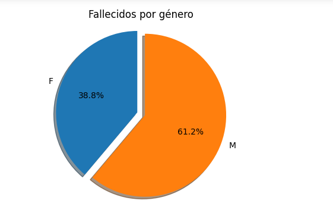
  
  * Distribucion de los casos totales por género
  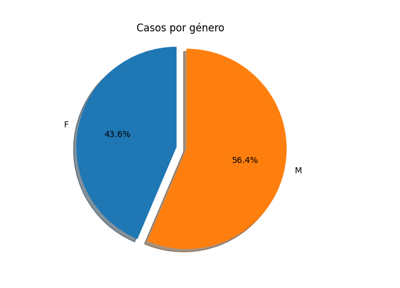
  
  * Distribucion de los casos por la atención actual
  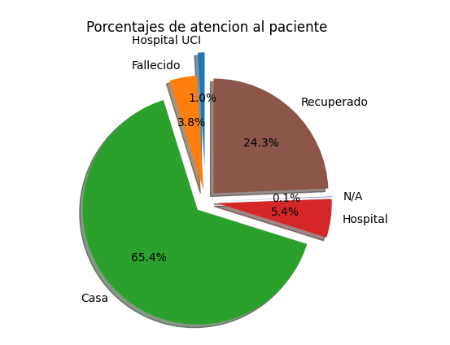
  
  * Curva por casos presentados cada mes(sin acumular casos)
  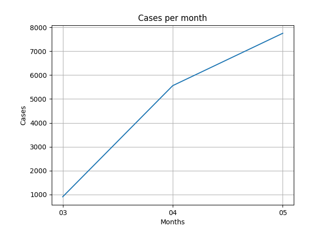
  
  * Curva de los casos fallecidos y casos recuperados , respecto a la curva de casos totales
  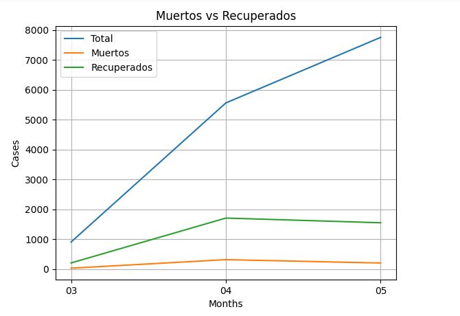
  
  * Casos totales reportados por mes, acumulados
  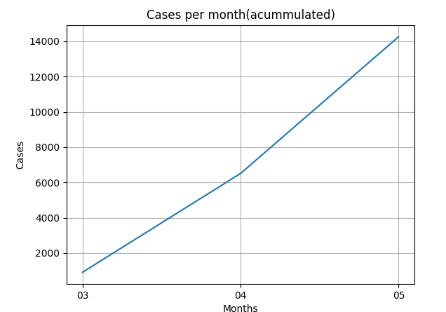
  
  * Casos reportados por edades
  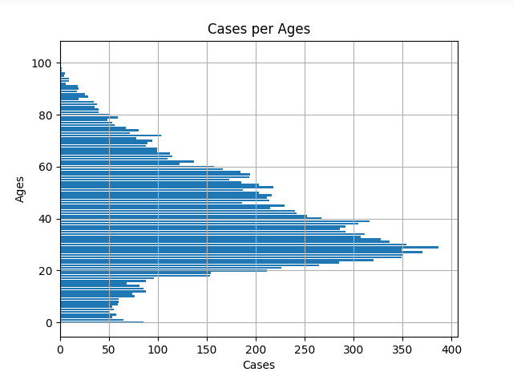
  
  * Distribucion del tipo de caso
  
  
  * Ciudades de donde provienen los casos importados 
  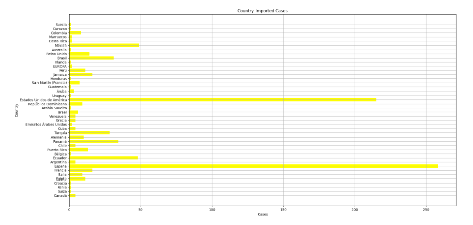
  
  * Estadistica de los casos fallecidos y recuperados por cada género
  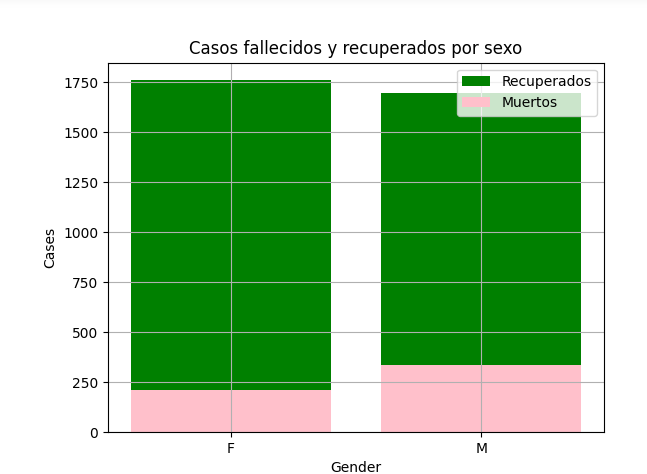
  
  * Distribución de los estados de los pacientes contagiados
  
  
## Notebook, EMR, Spark

Para ver mas detalladamente las consultas, funciones, y el origen de las graficas y visualizaciones acceda al notebook:
[MRjob exercise](mrjob)
